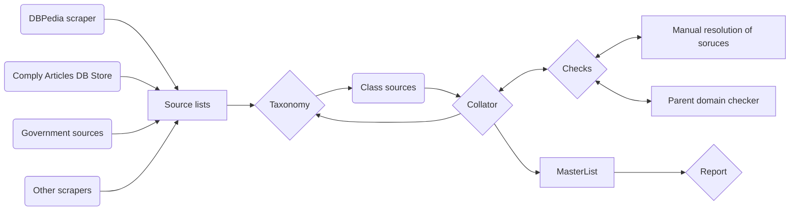

  <h3 align="center">📰 Country Reporter</h3>

  

    Country Reporter is a research tool that collates lists of media sources and reports on the available media sources in a country.
  

## Research Process

Country Reporter collates lists of media sources into a master list and outputs a country review report. This report type and number of sources that Comply covers; estimated number of sources in a country; and sources slated for review. 

### Data Collection

We have a list of sources in comply data that we want to compare to "what's out there". Sources that can tell us what media exists in a country range from open source directories, government directories (usually press ombudsman) and DBPedia.

At the collection stage we use or build scrapers and save each list of sources in tabs on the research sheet.

### Taxonomy & Collation

We have a taxonomy of media sources. Classifying sources is a two step process. We classify sources in the different sheets, starting with the dataset that is easiest to classify. For example, media ombudsman usually lists which sources are national or regional. Once we have classified those sources, we run the collator to create a master list. 

With the help of the master list, we can filter for sources in the comply list that did not merge with sources that have a classification. These domains are then manually classified. 

The collate and classify steps are repeated until all comply sources have been labelled. 

### Manual resolution

Throughout the classifying of sources, we often come across domains with similar names or the same name but different url. At present, we manually resolve these sources by ensuring that the name is consistent across all sheets. Upon rerunning collator, these sources are resolved. 

### Country Review Report

When the above steps are completed,  we breakdown the number of sources that Comply covers by type in a table. This table is then shared with clients along with a few examples of sources from each class.

The table is generated manually. Below the table of sources that Comply covers, the report lists domains that comply does not cover. These domains are slated for review. 