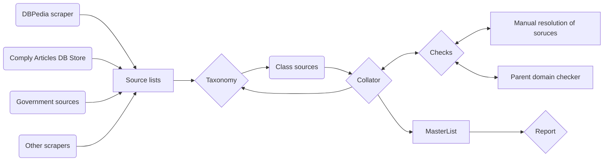

# Adverse Media Counry Review Process

## Background 

Adverse Media country reviews aim to produce a master list of sources that Comply covers and an estimate of the sources that exist in a country. 

The result if a country report with a table of the number of sources we cover by their taxonomy type and the estimated number of sources out there. 

In addition,the report flags domains that we miss and should review and consider adding. 

## Research Process

### Data Collection

We have a list of sources in comply data that we want to compare to "what's out there". Sources that can tell us what media exists in a country range from open source directories, government directories (usually press ombudsman) and DBPedia.

At the collection stage we use or build scrapers and save each list of sources in tabs on the research sheet.

### Taxonomy & Collation

We have a taxonomy of media sources. Classifying sources is a two step process. We classify sources in the different sheets, starting with the dataset that is easiest to classify. For example, media ombudsman usually lists which sources are national or regional. Once we have classified those sources, we run the collator to create a master list. 

With the help of the master list, we can filter for sources in the comply list that did not merge with sources that have a classification. These domains are then manually classified. 

The collate and classify steps are repeated until all comply sources have been labelled. 

### Manual resolution

Throughout the classifying of sources, we often come across domains with similar names or the same name but different url. At present, we manually resolve these sources by ensuring that the name is consistent across all sheets. Upon rerunning collator, these sources are resolved. 

