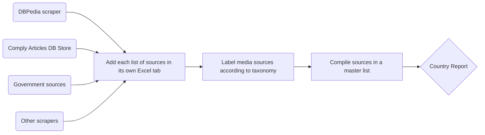
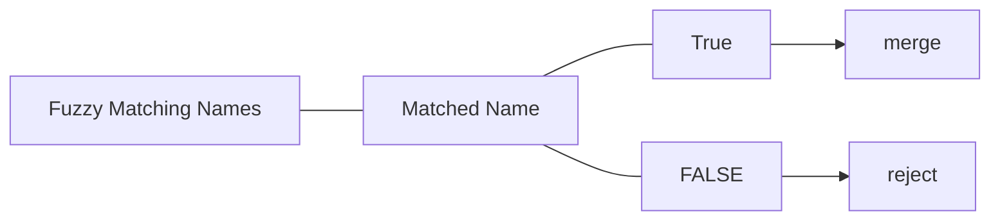

<p align="center">


  <h3 align="center">📰 Cartier </h3>

  <p align="center">
    Cartier is the Adverse Media team's research tool for conducting country reviews
  </p>
</p>


## Overview

**Cartier** is a tool designed to assist the adverse media team conduct thorough country reviews by collating and comparing media sources against the domains covered by Comply Advantage. 


## Get started

### 🐧 Set up linux for Windows

In order to install Cartier and Docker, make sure you have windows subsystem for Linux installed (WSL). 
Follow Microsoft's instructions to set up WSL. 

- https://learn.microsoft.com/en-us/windows/wsl/install

WSL should install with the following command in Windows PowerShell.

```
wsl --install
```
## 🐳 Install Docker

You can download Docker Desktop from the official website. Choose Windows - x86_64. 

- https://docs.docker.com/desktop/install/windows-install/

You can also download and install Docker Desktop from PowerShell with this command:

```
Start-Process 'Docker Desktop Installer.exe' -Wait install
```

Once you have Docker Desktop up an running, go to settings and select **Use WSL2 based engine** from the General tab. Select **Apply & Restart**.

Docker commands should now work from Windows using the WSL2 engine. 

Open up PowerShell and run:

```
docker run hello-world .
```


For more information about how to set up Docker with WSL, follow instructions on this page:

- https://docs.docker.com/desktop/wsl/


## 📰 Install Cartier

Contact your team leader to send you an invite to the repo with ownership permissions. Create your github account and clone the repo.

```
git clone https://gitlab.com/albintouma_comply/adverse-media.git
```

Cd into the repository and build the docker image with:

```
docker-compose up --build
```

This should install an image of the programme complete with Python, poetry, and dependencies. 


## Research Process

The research process involves identifying lists of media sources in a country and labelling those sources according to our taxonomy, and compiling a master list. 

Below is a diagram of each research step. Repeat these steps until every media source in each research sheets has a taxonomy label.




### Data Collection

We have a list of sources in comply data that we want to compare to "what's out there". Sources that can tell us what media exists in a country range from open source directories, government directories (usually press ombudsman) and DBPedia.

At the collection stage we use or build scrapers and save each list of sources in tabs on the research sheet.


### Taxonomy & Collation

We have a taxonomy of media sources. Classifying sources is a two step process. We classify sources in the different sheets, starting with the dataset that is easiest to classify. For example, media ombudsman sources and wikipedia usually list which sources are national or regional. Once we have classified those sources, we run the collator to create a master list. 

With the help of the master list, we can filter for sources in the comply list that did not merge with sources that have a classification. These domains are then manually classified. 

The collate and classify steps are repeated until all comply sources have been labelled. 

By collating sources, we avoid labelling domains twice in different sheets and we can identify domains that have not been labelled or have been labelled differently in different worksheets. If a domain has two different labels, revisit this domain and correct the mistake.

#### How Collation Works

We collate sources by fuzzy matching the names, concatenating sheets, and grouping concatenated sheet by name matched in fuzzy matching.




**Example**

Comply data

Provider | Name | URL | Taxonomy
-----|---- | ---- | ----
comply | The Guardian | https://www.guardian.com | international newspaper

Wiki data

Provider | Name | URL | Circulation | Taxonomy
-----| -----|----|---- | -----
wikipedia | The Guardian | https://www.guardian.com | 20000 | international newspaper

Master list

Source B:

Provider | Name | URL | Circulation | Taxonomy
-----| -----|----|---- | -----
[comply, wikipedia] | The Guardian | https://www.guardian.com | 20000 | [international newspaper, international newspaper]

## Country Review Report

When the above steps are completed,  we breakdown the number of sources that Comply covers by type in a table. This table is then shared with clients along with a few examples of sources from each class.


